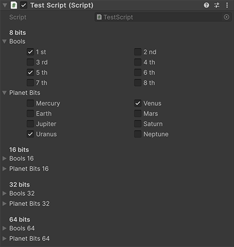

**MultiBool** is a Unity package designed to improve memory usage by using bit fields for boolean values.

# Installation

## Using OpenUPM

If you have [OpenUPM configured as a command-line interface](https://openupm.com/#get-started-with-cli-optional), add it to your project with this command:

```sh
openupm add dev.chsxf.multibool
```

## Using This Repository

Opens the Packages/manifest.json from your Unity project and add this to the dependencies property:

```json
"dev.chsxf.multibool": "https://github.com/chsxf/multibool.git"
```

# The Boolean Memory Problem

In C#, the `bool` type has a size of 1 byte (as reported by the `sizeof()` operator), but can be marshalled a 4-bytes integers in some cases. Even in the best scenario, that's a huge waste of memory if you use more than one boolean value in the same type, as boolean values only need a single bit to be represented.

**MultiBool** uses relevant types to pack bits in a more efficient way. **MultiBool** structures exist for 8, 16, 32 and 64 boolean values at once, mapping respectively to the `byte`, `ushort`, `uint` and `ulong` types.

# The `Flags` Enumeration Alternative

[Backed C# enumerations](https://learn.microsoft.com/en-us/dotnet/csharp/language-reference/builtin-types/enum) can be used as bit fields natively.

**This is the best solution to use for maximizing performance and memory usage.**

However, it is slightly more complicated to manipulate on a daily basis (to the notable exception of the [HasFlag](https://learn.microsoft.com/en-us/dotnet/api/system.enum.hasflag?view=net-9.0#system-enum-hasflag(system-enum)) method).

```csharp
enum TestFlagEnum {
    None = 0,
    FirstBit = 1 << 0,
    SecondBit = 1 << 1,
    ThirdBit = 1 << 2
}

TestFlagEnum value = TestFlagEnum.None;

// Setting a bit
value |= TestFlagEnum.SecondBit;

// Testing a bit
if (value.HasFlag(TestFlagEnum.SecondBit)) {
    Console.WriteLine("Second bit is set!");
}

// Clearing a bit
value &= ~TestFlagEnum.SecondBit;
```

# The MultiBool Compromise

MultiBool offers a compromise between the ease of use of regular booleans with the memory efficiency of enumeration bit fields.

```csharp
// Defining an 8-bit MultiBool
MultiBool8 mb = default;

// Setting a bit
mb[2] = true;

// Testing a bit
if (mb[2]) {
    Console.WriteLine("Second bit is set!");
}

// Clearing a bit
mb[2] = false;
```

## Generic Version

A generic version supporting enumeration types is also available. It makes using MultiBool a bit more explicit.

```csharp
enum Planet
{
    Mercury = 0,
    Venus = 1,
    Earth = 2,
    Mars = 3,
    Jupiter = 4,
    Saturn = 5,
    Uranus = 6,
    Neptune = 7
}

MultiBool8<Planet> planets = default;

// Setting a bit
planets[Planet.Earth] = true;

// Testing a bit
if (planets[Planet.Earth]) {
    Console.WriteLine("Earth's bit is set!");
}

// Clearing a bit
planets[Planet.Earth] = false;
```

# Use in Unity Scripts

MultiBool structures are serializable and can be used in any Unity script. There's also custom inspector property drawers available.

```csharp
using chsxf;

public class TestScript : MonoBehaviour {
    [Header("8 bits")]
    public MultiBool8 bools;
    public MultiBool8<Planet> planetBits;

    [Header("16 bits")]
    public MultiBool16 bools16;
    public MultiBool16<Planet> planetBits16;

    [Header("32 bits")]
    public MultiBool32 bools32;
    public MultiBool32<Planet> planetBits32;

    [Header("64 bits")]
    public MultiBool64 bools64;
    public MultiBool64<Planet> planetBits64;
}
```



# Performance

MultiBool is not as fast as either regular booleans or enumeration bit fields. You can expect a 3 to 4 times slower execution in most scenarios.

You can enable the **Tools > MultiBool > Performance Tester** menu to access the various test processes to see the results for yourself by adding the `ENABLE_MULTIBOOL_PERFORMANCE_TESTER` scripting define symbol to your Unity project.

Look into the [Editor.PerformanceTester](Editor.PerformanceTester) folder for more details on the test methodology.

# License

Unless stated otherwise, all source code and assets are distributed under the [MIT License](LICENSE).
